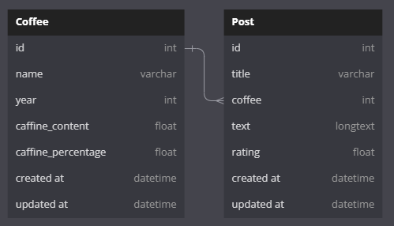

# App Academy Mock Takehome Backend Challenge

Welcome to a/A's takehome backend challenge, Ann loves coffee, so, we're going to make her a coffee blog! You know they say that caffine is the lifeblood of a software engineer.

we'll get started with the schema for the database: 
 
There will be two main tables, Coffee and Post. Post will have a many-to-one relationship with Coffee. Where coffee can have many posts, but posts may only have one coffee.

Then will need two main routes, coffee/, and posts/ as seen down here:
### Coffee Routes
| HTTP Method 	|     Route     	  |      Parameters     	| Return                                                                	|
|:-----------:	|:-------------:	  |:-------------------:	|-----------------------------------------------------------------------	|
|     GET     	| /coffee/ping   	  |         None          	| returns a {'status': 'good'}                                          	|
|     GET     	| /coffee       	  | order - [asc, desc] 	| Index of all coffees - default asc by name                            	|
|     GET     	| /coffee/\<id> 	  |         None        	| Returns single coffee with matching id                                    |
|     POST    	| /coffee/create/  	  |         None        	| Creates a new coffee and returns it                                   	|
|    DELETE   	| /coffee/delete/\<id>|         None        	| Destroys a coffee in the database - returns if deletion was a success 	|

### Post Routes
| HTTP Method 	|     Route     	|      Parameters     	| Return                                                                	|
|:-----------:	|:-------------:	|:-------------------:	|-----------------------------------------------------------------------	|
|     GET     	| /post/ping        |          None        	| returns a {'status': 'good'}                                          	|
|     GET     	| /post         	| order - [asc, desc] 	| index of all posts - default asc by post date                             |
|     GET     	| /post/\<id>   	|         None        	| Returns single post with matching id                                   	|
|     POST    	| /post         	|         None        	| Creates a new post and returns it                                     	|
|    DELETE   	| /post/\<id>   	|         None        	| Destroys a post in the database - returns if deletion was a success 	    |

### Bonus Route
Wouldn't it be cool if we could also sort posts by coffee?
| HTTP Method 	| Route 	|      Parameters     	| Return                                    	|
|:-----------:	|:-----:	|:-------------------:	|-------------------------------------------	|
|     GET     	| /post/coffee      |     id or name   	    | return all posts with coffee having a matching id OR name - if both are given prioritize id, sorted by date|  