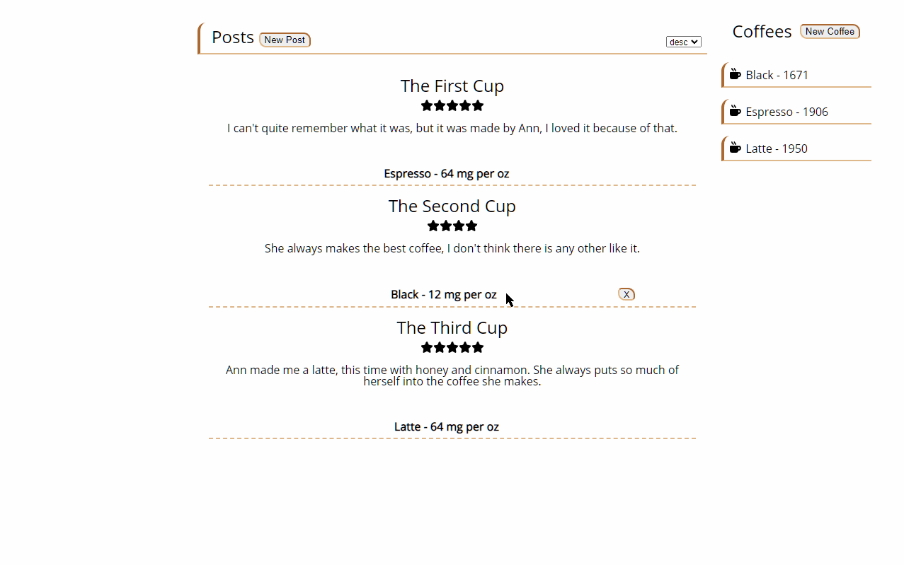
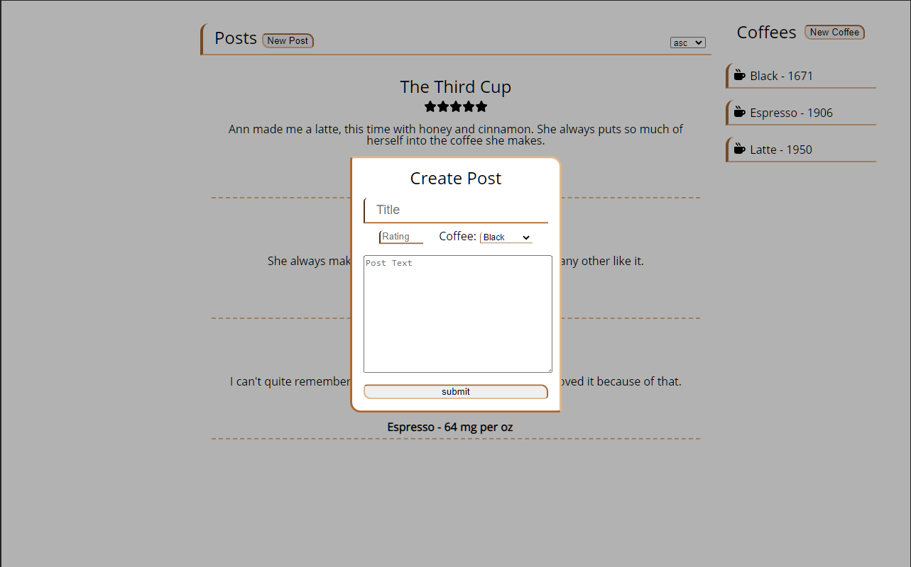
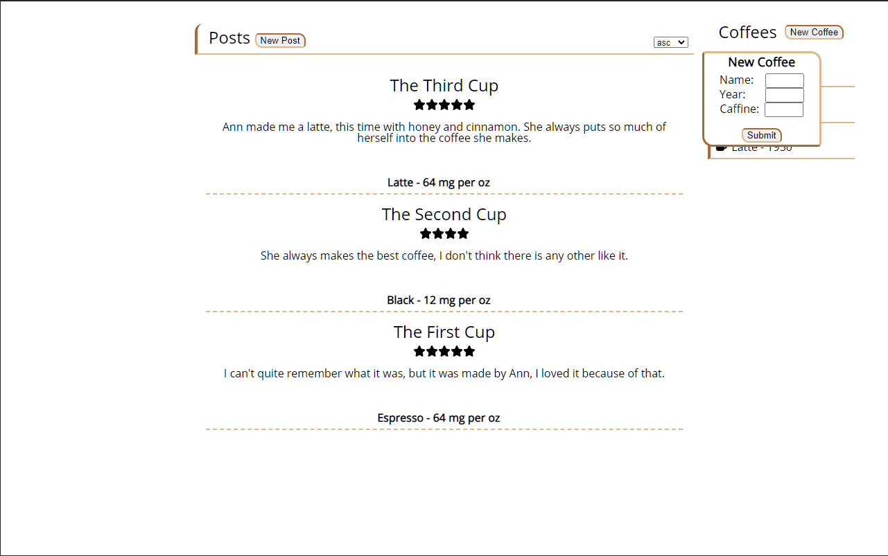

# App Academy Mock Takehome Frontend Challenge

Welcome to a/A's takehome frontend challenge, we will need a frontend to go with that backend for Ann's Coffee! we're going for more of minimalist design this time.
  
A quick look at what it will look like,
 
  
We will need two modals, one to create posts:
 
and another to add new coffees: 
(Caffine percentage will need to be calculated by us! remember it's the percentage of caffine in 1 oz of that coffee)

As seen in the first gif, you should be able to sort the post by date asc or desc.
both posts and coffee should be able to handle cases where there is enough data to fill the page.
Feel free to expand apon the style as long as it matches. You will be able to find the svgs you need in the asset folder.

<b>Bonus: Did you notice that we created a api call that lets us sort posts
by coffee(id/name) and yet we never used it? why not add that yourself</b>